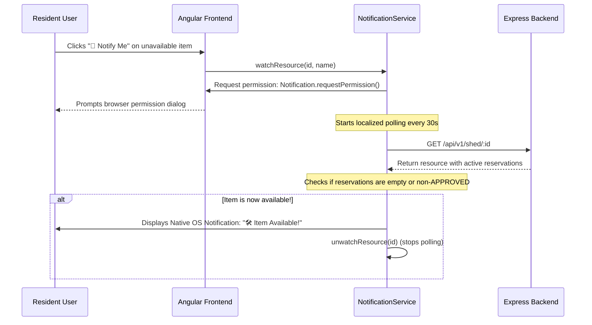

# Shared Shed Notification System

To enhance user experience and resource accessibility within the NEST platform, we implemented a real-time **"Notify Me When Available"** system for items in the Shared Shed. This document explains the technology stack, architectural decisions, and integration flow selected for this feature.

---

## 🛠️ Technology Stack

1. **Browser Notifications API**
   - **Type**: Native Web standard interface (`Notification`)
   - **Purpose**: Displays system-level/desktop alert notifications to the user even when they are looking at another tab or minimized browser window.
   - **Advantage**: Requires zero third-party dependencies or external service configuration (like Firebase or VAPID key registration), making it highly lightweight and perfect for high-speed local development.

2. **Angular computed() Signals & RxJS polling**
   - **Type**: Native Angular reactive state management + reactive extensions
   - **Purpose**: Provides low-latency polling of backend resources using an interval-based subscription system.
   - **Advantage**: Completely safe and highly responsive. Avoids resource-heavy server-side connection persistence (like continuous WebSockets or Server-Sent Events) by only polling active subscriptions on a localized interval (30 seconds), automatically cleaning up intervals on item availability or component destruction.

3. **Prisma & SQLite Backend**
   - **Type**: Database ORM & engine
   - **Purpose**: Exposes robust item status checks using relational models, mapping existing active reservations to filter item states.

---

## 🏗️ Architectural Flow

The notification subsystem is managed entirely via the frontend using a lightweight client-driven subscription:

---

## 📁 Key File Changes

- **[`resource-availability-notification.service.ts`](file:///d:/School/3rdY_S2/Licenta/NEST/frontend/src/app/shared/services/resource-availability-notification.service.ts)**: Singleton notification service that maintains the subscription map, polls the backend at standard intervals, and dispatches native browser notifications.
- **[`resource-card.component.ts`](file:///d:/School/3rdY_S2/Licenta/NEST/frontend/src/app/features/shed/resource-card/resource-card.component.ts)**: Modernized to Angular 21 Signals, injecting the notification service and computing if the item is currently watched.
- **[`resource-card.component.html`](file:///d:/School/3rdY_S2/Licenta/NEST/frontend/src/app/features/shed/resource-card/resource-card.component.html)**: Contextual buttons showing standard "Borrow Item" or beautiful warm-amber alert action buttons.
- **[`resource-card.component.scss`](file:///d:/School/3rdY_S2/Licenta/NEST/frontend/src/app/features/shed/resource-card/resource-card.component.scss)**: Beautiful warm amber-themed notification states with transition behaviors.
